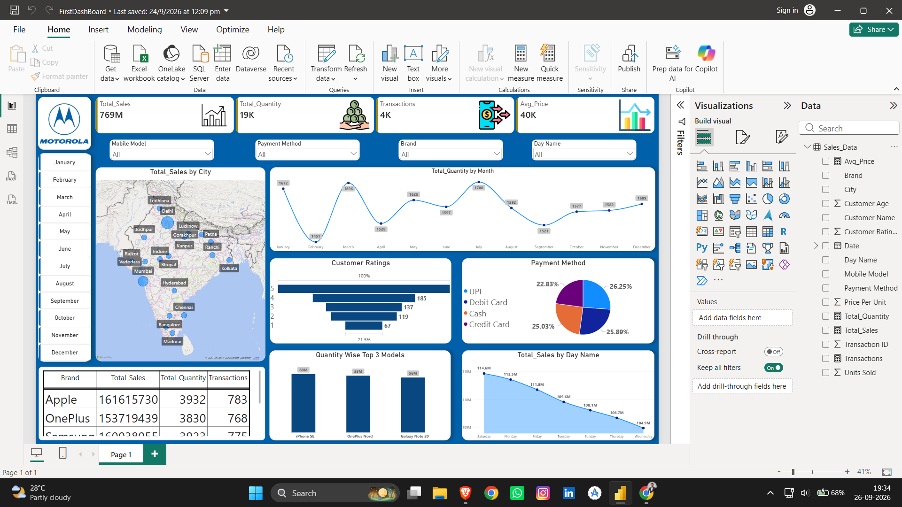

# Mobile Sales Dashboard (Power BI)

Interactive sales analytics dashboard built with Power BI, using Power Query for data cleaning and DAX for KPIs like revenue, profit, and sales trends.

## Dashboard Preview

## Dataset

Mobile sales data (`Day - 30 - Mobile Sales Data.xlsx`) used for this analysis.

## Tools Used

- Power BI Desktop
- Power Query (data cleaning)
- DAX (measures and KPIs)

## Files

- `FirstDashBoard.pbix`: Power BI project file (open with Power BI Desktop)
- `FirstDashBoard.pdf`: PDF export of the dashboard
- `Dashboard.png`: dashboard screenshot
- `Day - 30 - Mobile Sales Data.xlsx`: dataset

## Key Insights

- **[Apple]** is the top-selling brand with total sales of **[161.6M]**, followed by **[OnePlus]** at **[153.7M]**.
- Sales peaked in **[month]** and dipped in **[month]**.
- **[City/region]** generated the highest revenue.
- **[UPI]** was the most popular payment method at **[xx%]** of transactions.
- **[Day]** had the highest sales across the week.
